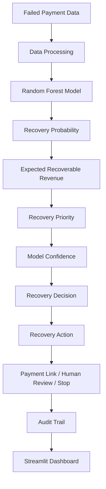

# 💰 AI Revenue Recovery Agent

An AI-powered prototype for predicting failed payment recovery opportunities, prioritizing recovery attempts, and executing bounded recovery actions.

## 📌 Project Overview

Payment failures can result in significant revenue loss for businesses. This project uses machine learning to estimate the probability that a failed payment can be recovered and then prioritizes recovery opportunities based on expected recoverable revenue.

The system combines:

* Machine Learning
* Recovery prioritization
* Model confidence
* Business rules
* Automated recovery actions
* Human review
* Audit logging
* Streamlit dashboard

> **Note:** This is a prototype/simulation project. It does not connect to real Razorpay payment systems or process real customer payments.

---

## 🎯 Problem Statement

When a payment fails, a business may have thousands of failed transactions to recover.

Contacting every customer is inefficient and can increase outreach costs.

The objective of this project is to answer:

> **Which failed payments should the business prioritize for recovery?**

The system predicts recovery probability and estimates the expected recoverable revenue for each failed payment.

---

## 🚀 Solution

The system follows this workflow:



## 📊 Dataset

The project uses a simulated dataset containing **10,000 payment records**.

The dataset contains information such as:

- Payment amount
- Payment method
- Hour of day
- Day of week
- Retry count
- Failure reason
- Failure source
- Failure step
* Customer tenure
* Previous successful payments
* Previous failed payments
* Recent customer activity
* Historical recovery rate
* Recovery outcome

### Target Variable

`recovered`

Where:

* `0` = Payment was not recovered
* `1` = Payment was recovered

---

## 🤖 Machine Learning Model

A **Random Forest Classifier** is used to predict payment recovery probability.

### Dataset Split

* Total records: 10,000
* Training records: 8,000
* Testing records: 2,000

### Model Evaluation

Current model results:

| Metric   |  Score |
| -------- | -----: |
| ROC-AUC  | 0.6742 |
| Accuracy | 0.6400 |

The model is used primarily for **ranking recovery opportunities**, rather than relying only on a fixed classification threshold.

---

## 💡 Recovery Opportunity

For each failed payment, the system calculates:

### Recovery Probability

The estimated probability that the failed payment can be recovered.

### Expected Recoverable Revenue

```text
Expected Recoverable Revenue
= Payment Amount × Recovery Probability
```

### Recovery Priority

Failed payments are ranked based on their expected recoverable revenue.

Each payment is assigned a recovery priority:

* **High** – High-value recovery opportunity
* **Medium** – Moderate recovery opportunity
* **Low** – Low recovery opportunity

### Model Confidence

The system estimates model confidence using prediction disagreement across the Random Forest.

Confidence levels:

* **High**
* **Medium**
* **Low**

This helps the system avoid fully automated actions when the model is uncertain.

---

## ⚙️ Recovery Decision Engine

The system converts model output into bounded recovery decisions using business rules.

Possible decisions:

* **Approve Recovery** – Suitable for automated recovery.
* **Standard Recovery** – Normal recovery workflow.
* **Human Review** – High-value opportunity but model confidence is low.
* **Stop / Do Not Pursue** – Recovery opportunity is too low or a stopping rule is triggered.

### Decision-to-Action Mapping

| Recovery Decision        | Recovery Action         | Status   | Purpose                                           |
| ------------------------ | ----------------------- | -------- | ------------------------------------------------- |
| **Approve Recovery**     | `GENERATE_PAYMENT_LINK` | APPROVED | Automatically initiate a high-value recovery      |
| **Standard Recovery**    | `GENERATE_PAYMENT_LINK` | APPROVED | Initiate a normal recovery opportunity            |
| **Human Review**         | `HUMAN_REVIEW`          | PENDING  | Send uncertain/high-value cases for manual review |
| **Stop / Do Not Pursue** | `STOP`                  | BLOCKED  | Do not pursue unsuitable recovery opportunities   |

The system therefore has four decision states but three executable actions. **Approve Recovery** and **Standard Recovery** both use the payment-link action, while the decision state indicates the recovery priority.

### Stopping Rule

The recovery engine enforces a per-payment limit of **2 recovery attempts**.

This prevents repeated recovery outreach to the same payment and helps control unnecessary customer contact and recovery costs.

The batch experiment uses a separate limit of **500 total recovery attempts** across the test batch. This is a batch-level budget and is different from the per-payment limit of 2 attempts.

---

## 💰 Business Impact

The system compares an AI-prioritized recovery strategy with a baseline strategy using the same number of recovery attempts.

### Experiment Setup

* Test batch: **2,000 failed payments**
* Recovery attempts: **500**
* Outreach cost per attempt: **₹25**
* Total outreach cost: **₹12,500**

> The **500 recovery attempts** represent the total outreach budget across the test batch. This is separate from the **per-payment limit of 2 recovery attempts**, which prevents repeated outreach to the same payment.

### Results

| Metric            |    Baseline | AI Prioritized |
| ----------------- | ----------: | -------------: |
| Recovery attempts |         500 |            500 |
| Outreach cost     |     ₹12,500 |        ₹12,500 |
| Recovered revenue | ₹951,354.78 |  ₹2,255,648.72 |
| Net recovery      | ₹938,854.78 |  ₹2,243,148.72 |

The AI-prioritized strategy generated **₹1,304,293.94 additional net recovery**, representing a **138.92% improvement** over the baseline in this simulated experiment.

A meaningful share of the recovery lift comes from prioritizing higher-value transactions. This is expected under expected-value optimization, where recovery probability is weighted by payment amount. The model has a modest ROC-AUC of 0.6742, so the result should be interpreted as a combination of recovery-probability ranking and transaction-value prioritization rather than as evidence of a highly accurate probability classifier.

> **Important:** These business impact results are based on simulated/test data and are not actual Razorpay production results.

---

## 🔗 Mock Payment Link & Recovery Actions

For approved recovery opportunities, the system generates a **simulated payment link**.

The mock payment link contains:

* Payment link ID
* Payment amount
* Payment link URL
* Payment link status

Example:

```text
Payment Link ID: plink_test_xxxxxxxxx
Payment Link URL: https://rzp.io/i/mock_xxxxxxxx
Status: created
```

No real payment is processed through these links.

### Recovery Messages

For approved recovery actions, the system generates a customer-facing recovery message containing the failed payment amount, failure reason, and simulated payment link.

---

## 📋 Audit Trail

Every recovery decision and action is recorded in an audit log for traceability.

The audit log is saved as:

```text
data/recovery_audit_log.csv
```

The audit trail records information such as:

* Payment ID
* Payment amount
* Recovery probability
* Expected recoverable revenue
* Recovery priority
* Model confidence
* Recovery action
* Action status
* Timestamp
* Reason for the decision
* Mock payment link details
* Recovery message

For the current test run, the audit log contains **2,000 records**.

This provides a record of why each failed payment was approved, sent for human review, or stopped.

---

## 📊 Streamlit Dashboard

The project includes an interactive Streamlit dashboard for monitoring recovery performance.

The dashboard displays:

* Failed payments
* Total amount at risk
* Approved recoveries
* Human reviews
* Baseline vs AI recovery performance
* Recovery priority distribution
* Model confidence distribution
* Recovery action distribution
* Model Exceptions
* Recovery audit trail

### Model Exceptions

The dashboard includes a dedicated **Model Exceptions** view for cases that require additional attention.

The view highlights low-confidence predictions and human-review cases, helping prevent uncertain cases from being handled automatically.

In the current test dataset:

* **600 cases** are classified as low-confidence exceptions.
* **109 cases** are escalated for human review.

---

## 📁 Project Structure

```text
razorpay-revenue-recovery/
│
├── app/
│   └── app.py
│
├── data/
│   ├── business_impact.json
│   ├── customers.csv
│   ├── payments.csv
│   └── recovery_audit_log.csv
│
├── src/
│   ├── generate_data.py
│   ├── train_model.py
│   ├── recovery_engine.py
│   ├── payment_link.py
│   └── message_generator.py
│
├── .gitignore
├── README.md
└── requirements.txt
```

---

## ▶️ How to Run

### 1. Clone the repository

```bash
git clone https://github.com/Shakshi-Jalan/razorpay-revenue-recovery.git

cd razorpay-revenue-recovery
```

### 2. Install dependencies

```bash
pip install -r requirements.txt
```

### 3. Generate the dataset

```bash
python src/generate_data.py
```

### 4. Train the model and run the recovery pipeline

```bash
python src/train_model.py
```

This generates the model predictions, recovery priorities, decisions, recovery actions, mock payment links, recovery messages, business impact results, and audit log.

### 5. Run the Streamlit dashboard

```bash
streamlit run app/app.py
```

The dashboard will open in your browser at the local Streamlit address.

---

## ⚠️ Disclaimer

This project is an educational prototype developed for demonstration purposes.

* It does **not** connect to the real Razorpay payment infrastructure.
* Payment link generation is **simulated** and no real payments are processed.
* The dataset used in this project is **simulated/test data**.
* The business impact results are based on a **simulated experiment** and do not represent actual Razorpay production results.
* This project is **not affiliated with or officially associated with Razorpay**.
